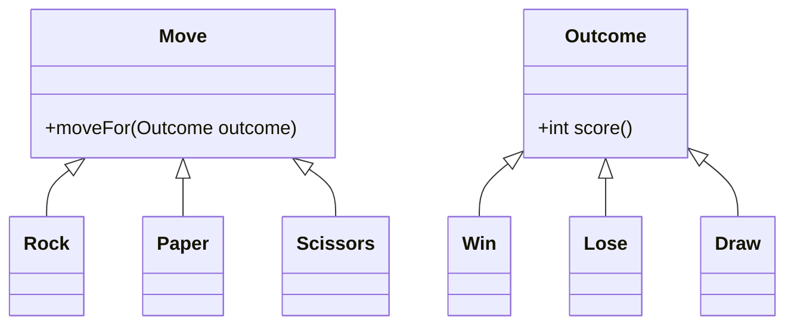

```mermaid
classDiagram
    Move <|-- Rock
    Move <|-- Paper
    Move <|-- Scissors
    Outcome <|-- Win
    Outcome <|-- Lose
    Outcome <|-- Draw
    
    class Outcome{
        +int score()
    }
    
    class Move{
        +moveFor(Outcome outcome)
    }
    
```

```mermaid
sequenceDiagram
    
```